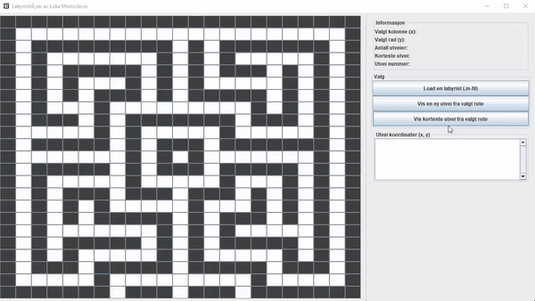

### MazeSolver
---



### Information
This Java application solves .in-mazes using a recursive maze-solving algorithm

#### This Java-program uses .ini-files of the structure below to find the exit.
#### The program has the following functionality:
- See shortest path
- See total number of paths
- Start / End position
- Path number
- Loading a new .in-path
- Iterate through paths
- See path chain

```
23 23
#######################
#.....................#
#.#########.#.#######.#
#.#.......#.#.#.....#.#
#.#.#####.#.#.###.#.#.#
#.#.#...#.#.#.....#.#.#
#.#.#.###.#.#####.#.#.#
#.#...#.........#.#.#.#
#.###.#.#######.###.#.#
#.....#.#.....#.....#.#
#.#####.#.###.#######.#
#.......#.#.#.......#.#
#.#####.#.###.#####.#.#
#.#.....#.....#...#.#.#
#.#.###.###.###.#.#.#.#
#.#.#.#.....#...#.#.#.#
#.#.#.#####.#.###.#.#.#
#.#.......#.#.#.....#.#
#.#.#####.#.#.#####.#.#
#.#.#.....#.#.....#.#.#
#.###.#####.#####.###.#
#.....#.........#.....#
#######.###.###.#######
```
